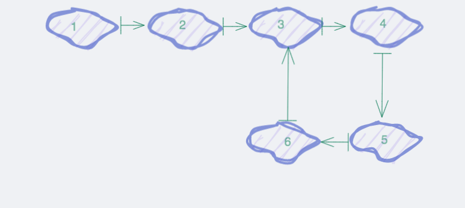
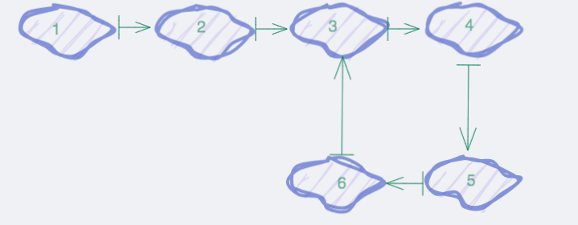
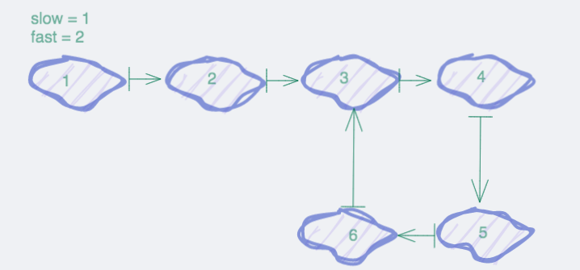
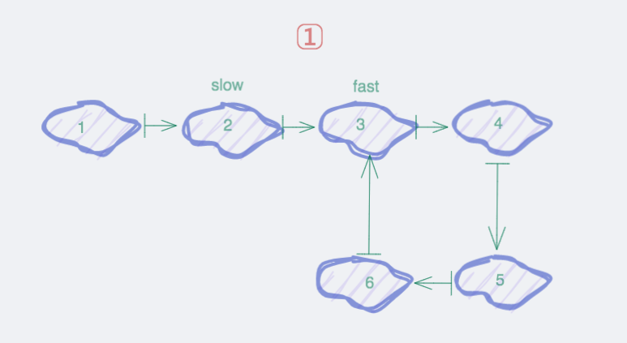
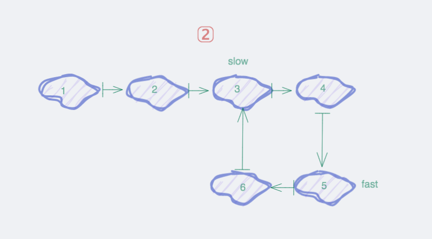
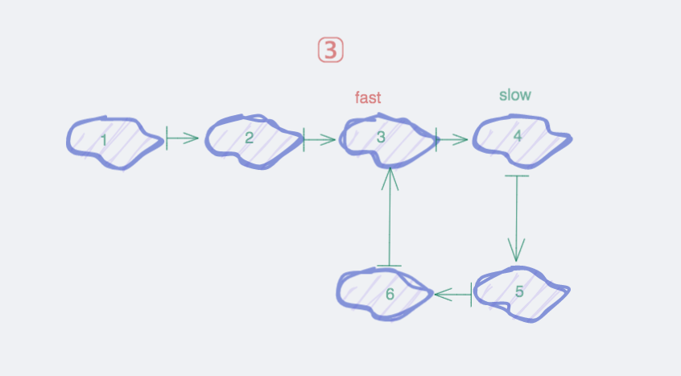
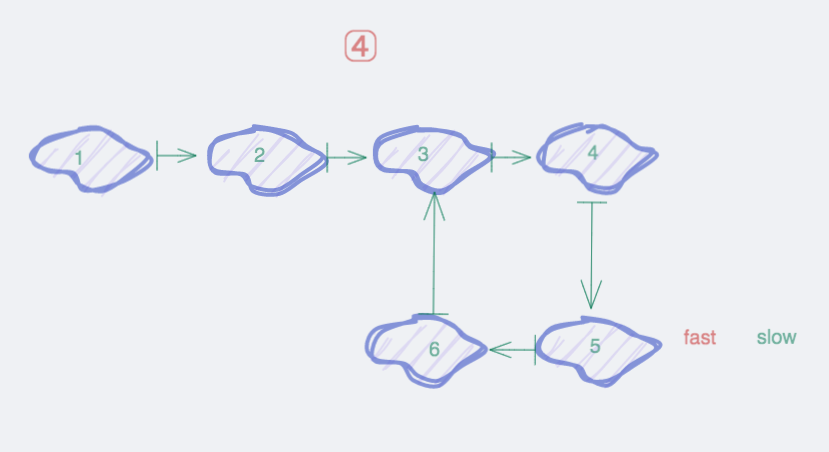
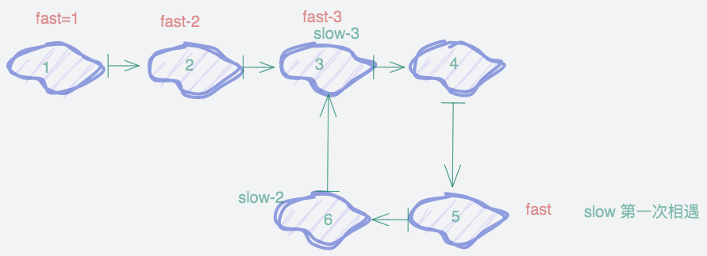
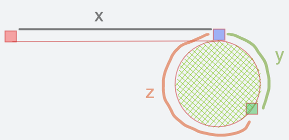

# 1、数组

- 数组指定下表的时间复杂度是O(1),不置顶下表是O(n)
- 数组的插入最后一个是O(1)，如果不是，涉及数据搬迁，时间复杂度是O(n)
- 数组删除，如果是最后一个，时间复杂度是O(1),不是的话时间复杂度是O(n)

查找O(1)

插入O(n)

删除O(n)


# 2、链表

插入O(1)

删除O(1)

查找O(n)


# 2、链表

## 一、链表反转

## 二、链表元素两两交换


## 三、链表是否有环及环的位置
给定链表，判断链表是否有环及环的位置
如下



<font color=red size=5x>**第一种-时间判断**</font>

给懂时间1s或者0.5s，来判定是否循环完毕。

此方法会有误差，如果链表足够长，并且没有环，而超过时间就会认定是有环


<font color=red size=5x>**第二种-set查重**</font>

设置map集合，将每次循环的链表元素地址存储在map中，当出现在map中存在的情况时候，就是存在环，而且能找出==环的入口==

```go
package main

import (
	"fmt"
)

/**
  给定链表，判断是否有环及环入口位置
*/

type nodeList struct {
	val int
	Next *nodeList
}


func isRing(head *nodeList)*nodeList{
	var Map = make(map[string]struct{})
	cur := head
	for cur != nil && cur.Next != nil{
		if _ ,ok := Map[fmt.Sprintf("%p",cur)];ok{
			return cur
		}
		Map[fmt.Sprintf("%p",cur)] = struct{}{}
		cur = cur.Next
	}
	return nil
}


func main(){

	n1 := new(nodeList)
	n1.val = 1

	n2 := new(nodeList)
	n2.val = 2

	n3 := new(nodeList)
	n3.val = 3
	n4 := new(nodeList)
	n4.val = 4

	n5 := new(nodeList)
	n5.val = 5

	n6 := new(nodeList)
	n6.val = 6


	n1.Next = n2
	n2.Next = n3
	n3.Next = n4
	n4.Next = n5
	n5.Next = n6
	n6.Next = n4

	fmt.Println(*isRing(n1))

}
```

<font color=red size=5x>**第三种-快慢指针**</font>



==第一步==



指定快慢指针，slow步幅为1，fast步幅为2

==第1次移动==



==第二次移动==




==第三次移动==



此时fast已经进入第二圈

==第四次移动==



此时fast和slow相遇，说明存在环

==代码==

```go
package main

import (
	"fmt"
)

/**
  给定链表，判断是否有环及环入口位置
*/

type nodeList struct {
	val int
	Next *nodeList
}


func isRingSet(head *nodeList)*nodeList{
	var Map = make(map[string]struct{})
	cur := head
	for cur != nil && cur.Next != nil{
		if _ ,ok := Map[fmt.Sprintf("%p",cur)];ok{
			return cur
		}
		Map[fmt.Sprintf("%p",cur)] = struct{}{}
		cur = cur.Next
	}
	return nil
}


func isRingCycle(head *nodeList)*nodeList{
	slow , fast := head,head
	for  slow != nil  && fast != nil && fast.Next != nil{
		slow = slow.Next
		fast = fast.Next.Next
		if slow == fast{
			return slow
		}
	}
	return nil
}


func main(){

	n1 := new(nodeList)
	n1.val = 1

	n2 := new(nodeList)
	n2.val = 2

	n3 := new(nodeList)
	n3.val = 3
	n4 := new(nodeList)
	n4.val = 4

	n5 := new(nodeList)
	n5.val = 5

	n6 := new(nodeList)
	n6.val = 6


	n1.Next = n2
	n2.Next = n3
	n3.Next = n4
	n4.Next = n5
	n5.Next = n6
	n6.Next = n4

	//fmt.Println(*isRingSet(n1))
	fmt.Println(*isRingCycle(n1))

}
```


```go
slow &{2 0xc00008e200}
fast &{3 0xc00008e210}
slow &{3 0xc00008e210}
fast &{5 0xc00008e230}
{4 0xc00008e220}
```


<font color=red size=5x>**环入口位置的确定**</font>

==第一种==

我们可以用hashset的方式，既能确定是否有环，能确定环的入口

==第二种==

快慢指针

快指针fast和慢指针slow从头开始出发，快指针每次走2步，慢指针每次走1步，当第一次相遇的时候，快指针从头出发，每次走一步，再次相遇的时候就是环的入口



```go
/**
快慢指针判断环的入口

fast = 2,slow = 1 当第一次相遇时候，快指针从起点走，
慢指针正常前行，当第二次相遇的时候就是环的入口

*/
func loopCycle(head *nodeList)*nodeList{
	slow,fast := head,head
	for slow != nil && fast.Next != nil{
		slow = slow.Next
		fast = fast.Next.Next
		if slow == fast{
			break
		}
	}

	fast = head
	for  slow != nil && fast != nil && fast.Next != nil{
		fast = fast.Next
		slow = slow.Next
		if fast == slow{
			return slow
		}
	}
	return nil
}
```

我们来论证一下



假设头节点到环入口的举例为x，环入口到第一次相遇的举例为y，第一次相遇到环入口的位置为z，
则slow走的举例为x+y，而fast走的距离为x+y +n(y+z)，也就是fast在环中走了n圈（n>=0），因为
fast每次走2步，slow走一步，所以fast是slow的2倍

```go
2(x+y) = x+y +n(y+z)
x = n(y+z)-y
x=(n-1)(y+z)+z
```

y+z是环的长度

有两种情况：

n=1 时，x=z，此时我们将 fast 放到链表头，然后 fast 和 slow 每次走一步，相遇节点就是环的入口；
n>1 时，我们将 fast 放到链表头，当 fast 和 slow 相遇时，说明 slow 在环里转了 n-1 圈后又走了z步，等价于 n=1 的情况。
