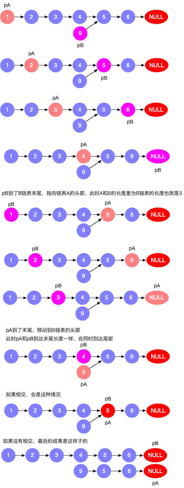

# 1、数组

- 数组指定下表的时间复杂度是O(1),不置顶下表是O(n)
- 数组的插入最后一个是O(1)，如果不是，涉及数据搬迁，时间复杂度是O(n)
- 数组删除，如果是最后一个，时间复杂度是O(1),不是的话时间复杂度是O(n)

查找O(1)

插入O(n)

删除O(n)


# 2、链表

插入O(1)

删除O(1)

查找O(n)


# 2、链表

## 一、链表反转

## 二、链表元素两两交换


## 三、链表是否有环及环的位置
给定链表，判断链表是否有环及环的位置
如下


<font color=red size=5x>**第一种-时间判断**</font>

给懂时间1s或者0.5s，来判定是否循环完毕。

此方法会有误差，如果链表足够长，并且没有环，而超过时间就会认定是有环


<font color=red size=5x>**第二种-set查重**</font>

设置map集合，将每次循环的链表元素地址存储在map中，当出现在map中存在的情况时候，就是存在环，而且能找出==环的入口==

```go
package main

import (
	"fmt"
)

/**
  给定链表，判断是否有环及环入口位置
*/

type nodeList struct {
	val int
	Next *nodeList
}


func isRing(head *nodeList)*nodeList{
	var Map = make(map[string]struct{})
	cur := head
	for cur != nil && cur.Next != nil{
		if _ ,ok := Map[fmt.Sprintf("%p",cur)];ok{
			return cur
		}
		Map[fmt.Sprintf("%p",cur)] = struct{}{}
		cur = cur.Next
	}
	return nil
}


func main(){

	n1 := new(nodeList)
	n1.val = 1

	n2 := new(nodeList)
	n2.val = 2

	n3 := new(nodeList)
	n3.val = 3
	n4 := new(nodeList)
	n4.val = 4

	n5 := new(nodeList)
	n5.val = 5

	n6 := new(nodeList)
	n6.val = 6


	n1.Next = n2
	n2.Next = n3
	n3.Next = n4
	n4.Next = n5
	n5.Next = n6
	n6.Next = n4

	fmt.Println(*isRing(n1))

}
```

<font color=red size=5x>**第三种-快慢指针**</font>


==第一步==


指定快慢指针，slow步幅为1，fast步幅为2

==第1次移动==


==第二次移动==


==第三次移动==


此时fast已经进入第二圈

==第四次移动==


此时fast和slow相遇，说明存在环

==代码==

```go
package main

import (
	"fmt"
)

/**
  给定链表，判断是否有环及环入口位置
*/

type nodeList struct {
	val int
	Next *nodeList
}


func isRingSet(head *nodeList)*nodeList{
	var Map = make(map[string]struct{})
	cur := head
	for cur != nil && cur.Next != nil{
		if _ ,ok := Map[fmt.Sprintf("%p",cur)];ok{
			return cur
		}
		Map[fmt.Sprintf("%p",cur)] = struct{}{}
		cur = cur.Next
	}
	return nil
}


func isRingCycle(head *nodeList)*nodeList{
	slow , fast := head,head
	for  slow != nil  && fast != nil && fast.Next != nil{
		slow = slow.Next
		fast = fast.Next.Next
		if slow == fast{
			return slow
		}
	}
	return nil
}


func main(){

	n1 := new(nodeList)
	n1.val = 1

	n2 := new(nodeList)
	n2.val = 2

	n3 := new(nodeList)
	n3.val = 3
	n4 := new(nodeList)
	n4.val = 4

	n5 := new(nodeList)
	n5.val = 5

	n6 := new(nodeList)
	n6.val = 6


	n1.Next = n2
	n2.Next = n3
	n3.Next = n4
	n4.Next = n5
	n5.Next = n6
	n6.Next = n4

	//fmt.Println(*isRingSet(n1))
	fmt.Println(*isRingCycle(n1))

}
```


```go
slow &{2 0xc00008e200}
fast &{3 0xc00008e210}
slow &{3 0xc00008e210}
fast &{5 0xc00008e230}
{4 0xc00008e220}
```


<font color=red size=5x>**环入口位置的确定**</font>

==第一种==

我们可以用hashset的方式，既能确定是否有环，能确定环的入口

==第二种==

快慢指针

快指针fast和慢指针slow从头开始出发，快指针每次走2步，慢指针每次走1步，当第一次相遇的时候，快指针从头出发，每次走一步，再次相遇的时候就是环的入口


```go
/**
快慢指针判断环的入口

fast = 2,slow = 1 当第一次相遇时候，快指针从起点走，
慢指针正常前行，当第二次相遇的时候就是环的入口

*/
func loopCycle(head *nodeList)*nodeList{
	slow,fast := head,head
	for slow != nil && fast.Next != nil{
		slow = slow.Next
		fast = fast.Next.Next
		if slow == fast{
			break
		}
	}

	fast = head
	for  slow != nil && fast != nil && fast.Next != nil{
		fast = fast.Next
		slow = slow.Next
		if fast == slow{
			return slow
		}
	}
	return nil
}
```

我们来论证一下


假设头节点到环入口的举例为x，环入口到第一次相遇的举例为y，第一次相遇到环入口的位置为z，
则slow走的举例为x+y，而fast走的距离为x+y +n(y+z)，也就是fast在环中走了n圈（n>=0），因为
fast每次走2步，slow走一步，所以fast是slow的2倍

```go
2(x+y) = x+y +n(y+z)
x = n(y+z)-y
x=(n-1)(y+z)+z
```

y+z是环的长度

有两种情况：

n=1 时，x=z，此时我们将 fast 放到链表头，然后 fast 和 slow 每次走一步，相遇节点就是环的入口；
n>1 时，我们将 fast 放到链表头，当 fast 和 slow 相遇时，说明 slow 在环里转了 n-1 圈后又走了z步，等价于 n=1 的情况。


## 四、两个链表是否相交及交点


<font color=red size=5x>链表结构</font>

```go
//构造链表
	n1 := new(nodeList)
	n1.val = 1

	n2 := new(nodeList)
	n2.val = 2

	n3 := new(nodeList)
	n3.val = 3
	n4 := new(nodeList)
	n4.val = 4

	n5 := new(nodeList)
	n5.val = 5

	n6 := new(nodeList)
	n6.val = 6


	n1.Next = n2
	n2.Next = n3
	n3.Next = n4
	n4.Next = n5
	n5.Next = n6

	//链表2
	e1 := new(nodeList)
	e1.val = 9

	e2 := new(nodeList)
	e2.val = 5

	e3 := new(nodeList)
	e3.val = 6


	e1.Next = e2
	e2.Next = e3
	e3.Next = n5

	fmt.Println(*isCycleSet(n1,e1))
```


### HashSet

此种方法简单，但是时间复杂度和空间复杂度都是O(n)

思路

- 遍历链表A，将链表地址存储在hashSet中
- 遍历链表B，如果链表B存在hashSet中，则此时就是交点


==代码==

```go
/**
	hashSet的解法
	1、遍历链表A，将链表地址存储在hashSet中
	2、遍历链表B，如果链表B存在hashSet中，则此时就是交点

	时间复杂度O(n)，空间复杂度O(n)
*/
func isCycleSet(a,b *nodeList)*nodeList{
	var pMap = make(map[string]struct{})
	for a.Next != nil{
		pMap[fmt.Sprintf("%p",a)] = struct{}{}
		a = a.Next
	}

	for b.Next != nil{
		if _ ,ok := pMap[fmt.Sprintf("%p",b)];ok{
			return b
		}
		b= b.Next
	}

	return nil
}
```


```go
{5 0xc00008e230}
```


### 快慢指针

空间复杂度O(1)

时间复杂度O(n)


==如果两个链表相交，那么相交后的长度是相同的==

构造相同长度的链表

1. 指针 pA 指向 A 链表，指针 pB 指向 B 链表，依次往后遍历
2. 如果 pA 到了末尾，则 pA = headB 继续遍历
3. 如果 pB 到了末尾，则 pB = headA 继续遍历
4. 比较长的链表指针指向较短链表head时，长度差就消除了
5. 如此，只需要将最短链表遍历两次即可找到位置





==代码==

```go
/**
	快慢指针
	1、指针 pA 指向 A 链表，指针 pB 指向 B 链表，依次往后遍历
	2、如果 pA 到了末尾，则 pA = headB 继续遍历
	3、如果 pB 到了末尾，则 pB = headA 继续遍历
	4、比较长的链表指针指向较短链表head时，长度差就消除了
	5、如此，只需要将最短链表遍历两次即可找到位置
	总的思想就是 我吹过你吹过的晚风
	时间复杂度o(m+n) 也就是o(n)
	空间复杂度O(1)
*/
func isCycleRun(a,b *nodeList)*nodeList{
	if a==nil || b == nil{
		return nil
	}
	headA,headB  := a,b
	for a != b{
		if a == nil{
			a = headB
		}else{
			a=a.Next
		}

		if b == nil{
			b = headA
		}else{
			b = b.Next
		}
	}

	return a
}
```


```go
{5 0xc00008e230}
```


## 五、删除or输出链表倒数的第k个元素

题目描述

给你一个链表，删除链表的倒数第 n 个结点，并且返回链表的头结点。

进阶：你能尝试使用一趟扫描实现吗？

 

示例 1：


输入：head = [1,2,3,4,5], n = 2
输出：[1,2,3,5]
示例 2：

输入：head = [1], n = 1
输出：[]
示例 3：

输入：head = [1,2], n = 1
输出：[1]


<font color=red size=5x>获取链表长度，遍历拼接</font>


```go
/**
	思路1
	遍历链表，获取长度l
	再次遍历链表，第k个坐标为l-1-k
	时间复杂度O(3n),也就是O(n)
	空间复杂度O(3n),也就是O(n)
*/
func delK(head *nodeList,n int)*nodeList{
	var (
		l int
		sl []*nodeList
		slC []*nodeList
	)
	for head != nil{
		sl = append(sl,head)
		head = head.Next
		l++
	}

	for i,v := range sl{
		if i == l-n{
			continue
			//如果需要输出第k个元素就可以输出了
		}
		slC = append(slC,v)

	}

	for i,v:= range slC{
		if i < len(slC)-1{
			v.Next = slC[i+1]

		}
	}

	return slC[0]
}

```


```go
1
&{2 0xc00008e200}
2
&{3 0xc00008e220}
3
&{5 0xc00008e230}
5
&{6 <nil>}
```


<font color=red size=5x>**快慢指针**</font>

- fast首先走n + 1步 ，为什么是n+1呢，因为只有这样同时移动的时候slow才能指向删除节点的上一个节点（方便做删除操作）
- fast和slow同时移动，之道fast指向末尾
- 删除slow指向的下一个节点，如图


```go
/**
	快慢指针想起始位置一起出发，快指针移动到快k的位置
	快指针比慢指针快k+1步，当快指针到的尾部的时候，慢指针正好是要删除的或者输出的元素、
	为什么是k+1步，因为只有这样，当快指针到达尾部的时候，慢指针才是指向要删除元素的上一个元素
	时间复杂度O(n)
	空间复杂度O(1)
*/
func delFRun(head *nodeList,n int)*nodeList{
	//构造虚拟头节点，避免头节点单独处理
	dummyNode := new(nodeList)
	dummyNode.Next = head

	var slow *nodeList
	cur := dummyNode
	//fmt.Printf("%p\n",cur) //0xc000010260
	//fmt.Printf("%p\n",dummyNode)//0xc000010260
	
	i:=1
	for head != nil{
		//slow先不走，让快指针到达k+1的位置
		if i>=n{
			slow = cur//要删除元素的上一个元素
			cur = cur.Next//慢指针移动
		}
		i++
		head = head.Next
	}

	slow.Next = slow.Next.Next

	return dummyNode.Next
}

```


# 4、栈
栈 栈顶是O(1)，栈底O(n)

## 一、检查全部括号是否匹配

leetcode20

```handlebars
给定一个只包括 '('，')'，'{'，'}'，'['，']' 的字符串 s ，判断字符串是否有效。

有效字符串需满足：

左括号必须用相同类型的右括号闭合。
左括号必须以正确的顺序闭合。
```


<font color=red size=5x>**解题思路**</font>

- ==如果有一个右括号和前一个是不匹配的，就是不匹配==

- 将左括号和右括号分开
- 左括号入栈，遇到右括号和栈顶的元素对比
- 防止全部左括号和全部右括号的情况


此时遇到第一个右括号和栈顶的元素对比，如果满足，消除栈顶的这个元素


此时满足消除


一次进行

- ==在遍历中有右括号的时候，栈为空，就不满足==
- ==最后栈不是空的，也是有不匹配的==


<font color=red size=5x>**代码**</font>

```go
/**
给定一个只包括 '('，')'，'{'，'}'，'['，']' 的字符串 s ，判断字符串是否有效。

有效字符串需满足：

左括号必须用相同类型的右括号闭合。
左括号必须以正确的顺序闭合。
	时间复杂度O(n)
	空间复杂度o(n)
 */

func isValid(s []byte) bool {
	Mp := map[byte]byte{
		')':'(',
		'}':'{',
		']':'[',
	}

	stack := []byte{}

	for _ ,v := range s{
		if v1,ok := Mp[v];!ok{
			stack = append(stack,v)
		}else {
			//stack < 1 防止全是右边的
			//和栈顶的比较，如果遇到的第一个右括号和栈顶的不匹配，肯定就不符合了
			if len(stack) <1 || v1 != stack[len(stack)-1]{
				return false

			}else{
				//匹配的话移除元素
				stack = stack[0:len(stack)-1]
			}
		}

	}
	//防止只有(( 左括号这种
	if len(stack) > 0{
		return false
	}

	return true
}
```


# 5、二叉树==搜索==树

- 每个节点至多有两个子节点
- 子节点左边的节点必须小于根节点
- 子节点右边的元素必须全部大于根节点

## 题

```go
给定一个二叉树，判断其是否是一个有效的二叉搜索树。

假设一个二叉搜索树具有如下特征：

节点的左子树只包含小于当前节点的数。
节点的右子树只包含大于当前节点的数。
所有左子树和右子树自身必须也是二叉搜索树。
示例 1:

输入:
    2
   / \
  1   3
输出: true
示例 2:

输入:
    5
   / \
  2   4
     / \
    3   6
输出: false
解释: 输入为: [5,1,4,null,null,3,6]。
     根节点的值为 5 ，但是其右子节点值为 4 。
```


- 图1是满足的 右边的所有左子节点都是满足小于根节点，右子节点大于根节点
- 图2中的4室不满足大于根节点5的，所以不符合

<font color=red size=5x>**构造数据**</font>

```go

type TreeNode struct {
	Val int
	Left *TreeNode
	Right *TreeNode
}

root1 := &TreeNode{
		Val:   5,
		Left:  &TreeNode{
			Val:   3,
			Left:  &TreeNode{
				Val:   1,
				Left:  nil,
				Right: nil,
			},
			Right: &TreeNode{
				Val:   2,
				Left:  nil,
				Right: nil,
			},
		},
		Right: &TreeNode{
			Val:   7,
			Left:  &TreeNode{
				Val:   6,
				Left:  nil,
				Right: nil,
			},
			Right: &TreeNode{
				Val:   8,
				Left:  nil,
				Right: nil,
			},
		},
	}
```


<font color=red size=5x>**第一种递归**</font>


```go
func isValidBST(root *TreeNode) bool {
	return isValidBSTImpl(root, -1 << 63, 1 << 63 -1)
}


func isValidBSTImpl(n *TreeNode, min int, max int) bool {
	if n == nil {
		return true
	}

	//左节点的是最小-999... 或者左节点的最大值 >= 根节点 ---->不满足条件
	//右节点的最小值<=跟节点  或者最大值越界999... ----->不满足
	if n.Val <= min || n.Val >= max {
		return false
	}
	return isValidBSTImpl(n.Left, min,n.Val) && isValidBSTImpl(n.Right, n.Val, max)
}
```


<font color=red size=5x>**第二种-中序遍历**</font>

中序遍历出来的是有序的，值需要比较前一个和后一个的关系是否满足后者大于前者就可以


- 图中 红色是正向的驱动
- 图中绿色是返回条件
- 图中蓝色是右子节点
- 1⃣️、2⃣️是执行顺序
- 要在脑海中走一遍程序，印象会更深刻


```go
var Pre = -1 << 63

func isValidBST1(root *TreeNode)bool{
	if root == nil{
		return true
	}
	if !isValidBST1(root.Left){
		return false
	}
	if root.Val <= Pre{
		return false
	}
	Pre = root.Val

	return isValidBST1(root.Right)

}
```


# 6、二叉树的最近公共祖先

示例 1：


```go
输入：root = [3,5,1,6,2,0,8,null,null,7,4], p = 5, q = 1
输出：3
解释：节点 5 和节点 1 的最近公共祖先是节点 3 。
```


示例 2：


```go
输入：root = [3,5,1,6,2,0,8,null,null,7,4], p = 5, q = 4
输出：5
解释：节点 5 和节点 4 的最近公共祖先是节点 5 。因为根据定义最近公共祖先节点可以为节点本身。
```


```go
示例 3：
输入：root = [1,2], p = 1, q = 2
输出：1
```


<font color=red size=5x>**分析**</font>

此题找的是最近，如果左有，右边也有，最近的肯定是第一次就遇到的值是最近的


分集几种情况
1. 如果p、q都在左侧，那么遇到的提前遇到的肯定是最早的公共父节点
2. 如果p、q都在右侧，那么最早遇到的节点一定是最早的公共父节点
3. 如果p、q存在于左右两侧，那么最早的公共父节点一定是root节点


基于此规则，那么我们分别在左侧和右侧寻找

- 如果左侧为空，那么说明都在右侧，返回右侧的第一个遇到的
- 如果右侧为空，说明都在左侧，返回遇到的第一个
- 如果左右都不为空，那么最早的一定是跟节点


==构造树结构==

```go
type TreeNode struct {
	Val int
	Left *TreeNode
	Right *TreeNode
}

root1 := &TreeNode{
		Val:   3,
		Left:  &TreeNode{
			Val:   5,
			Left:  &TreeNode{
				Val:   6,
				Left:  nil,
				Right: nil,
			},
			Right: &TreeNode{
				Val:   2,
				Left:  &TreeNode{
					Val:   7,
					Left:  nil,
					Right: nil,
				},
				Right: &TreeNode{
					Val:   4,
					Left:  nil,
					Right: nil,
				},
			},
		},
		Right: &TreeNode{
			Val:   1,
			Left:  &TreeNode{
				Val:   0,
				Left:  nil,
				Right: nil,
			},
			Right: &TreeNode{
				Val:   8,
				Left:  nil,
				Right: nil,
			},
		},
	}
	l := &TreeNode{
		Val:   5,
		Left:  nil,
		Right: nil,
	}
	r := &TreeNode{
		Val:   1,
		Left:  nil,
		Right: nil,
	}
```


```go
func lowestCommonAncestor(root, p, q *TreeNode) *TreeNode {
	if root == nil {
		return nil
	}
	if root.Val == p.Val || root.Val == q.Val {
		return root
	}
	left := lowestCommonAncestor(root.Left, p, q)
	right := lowestCommonAncestor(root.Right, p, q)
	if left != nil && right != nil {
		return root
	}
	if left == nil {
		return right
	}
	return left
}
```


## BST查找最近公共父节点

BST的话，是左侧全部小雨跟节点，右侧全部大于跟节点，基于这个特点，我们可以看q、p是比root大还是小，还是有大有小

```go
func lowestCommonAncestor(root, p, q *TreeNode) *TreeNode {
	if root == nil {
		return nil
	}

	if (root.Val - p.Val) * (root.Val - q.Val) < 0{
		return root
	}
	if p.Val < root.Val{
		return lowestCommonAncestor(root.Left, p, q)
	}
	if p.Val > root.Val{
		return lowestCommonAncestor(root.Right, p, q)
	}
	return nil
}
```


# 7、二叉树遍历

## 二叉树

首先，二叉树是一种「数据结构」。简单来说，就是一个包含**节点**，以及它的**左右孩子**的一种数据结构。


## 遍历方式

- 先序遍历，根节点-> 左孩子 -> 右孩子 的方式遍历，即「先序遍历」，每次遍历跟节点
   1 -> 2 -> 4 -> 5 -> 3 -> 6 -> 7
- 中序遍历，左孩子-> 根节点->右孩子 的方式遍历，即「中序遍历」，遍历结果为
   4 -> 2 -> 5 -> 1 -> 6 -> 3 -> 7
- 后序遍历，左孩子->右孩子->根节点 的方式遍历，即「后序遍历」，遍历结果为
   4 -> 5 -> 2 -> 6 -> 7 -> 3 -> 1
- 层级遍历,就是按照每一层从左向右遍历，遍历结果
   1 -> 2 -> 3 -> 4 -> 5 -> 6 -> 7


## 相关题目

### 相关题目

这里是 4 道相关题目：

1. [144.二叉树的前序遍历](https://leetcode-cn.com/problems/binary-tree-preorder-traversal/)
2. [94. 二叉树的中序遍历](https://leetcode-cn.com/problems/binary-tree-inorder-traversal/)
3. [145. 二叉树的后序遍历](https://leetcode-cn.com/problems/binary-tree-postorder-traversal/)
4. [102. 二叉树的层序遍历](https://leetcode-cn.com/problems/binary-tree-level-order-traversal/)


这四道题目描述是相似的，就是给定一个二叉树，让我们使用一个数组来返回遍历结果，首先来看递归解法。


